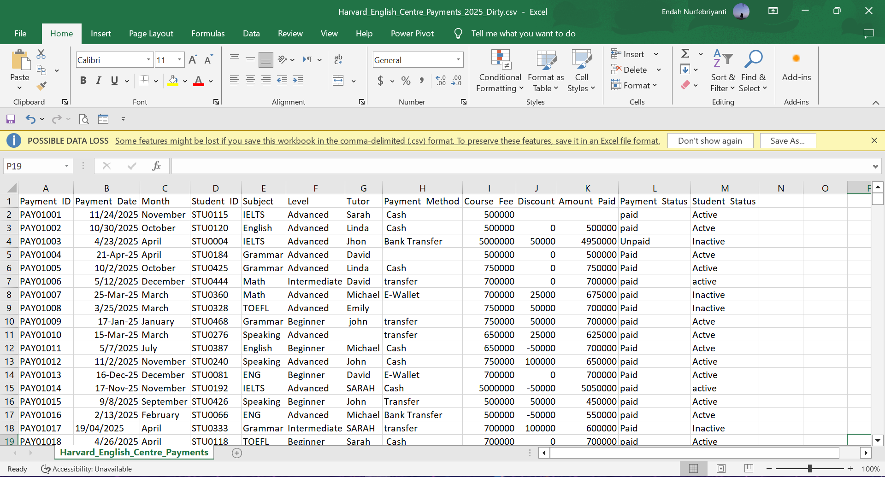
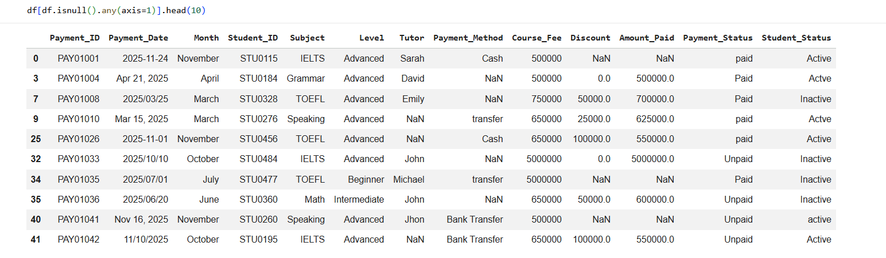
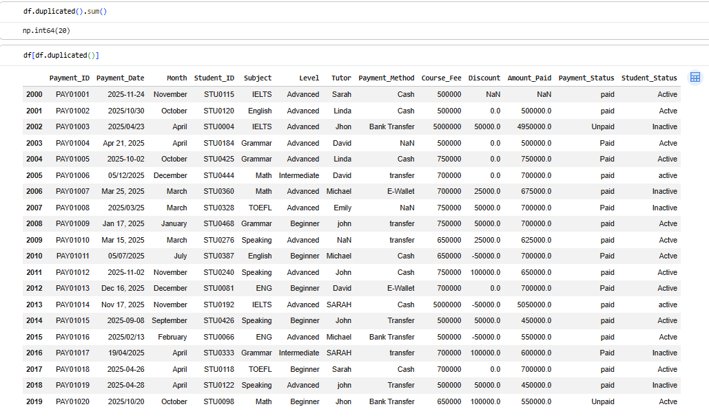

# 🧹 Data Cleaning with Pandas using Google Colab


A complete beginner-friendly **Data Cleaning Tutorial** using **Python Pandas** in **Google Colab**.

This project demonstrates how to transform a messy dataset into a clean and analysis-ready dataset using real-world data cleaning techniques.

---

# 📚 Table of Contents

- Project Overview
- Dataset Description
- Objectives
- Technologies Used
- Project Structure
- Data Cleaning Workflow
- Tutorial Steps
- Final Dataset
- How to Run
- YouTube Tutorial
- Repository Preview
- License

---

# 📌 Project Overview

Data cleaning is one of the most important steps in every data analysis project.

Poor-quality data can lead to inaccurate analysis, misleading insights, and incorrect business decisions.

In this project, we clean a fictional payment dataset from **Harvard English Centre** using **Python Pandas** in **Google Colab**.

The dataset intentionally contains various data quality issues, making it perfect for learning and practicing data cleaning.

---

# 📂 Dataset Description

Dataset Name

```
Harvard_English_Centre_Payments_2025_Dirty.csv
```

The dataset contains payment records with the following columns:

| Column |
|---------|
| Payment_ID |
| Payment_Date |
| Month |
| Student_ID |
| Subject |
| Level |
| Tutor |
| Payment_Method |
| Course_Fee |
| Discount |
| Amount_Paid |
| Payment_Status |
| Student_Status |

The dataset includes intentionally created problems such as:

- Missing values
- Duplicate rows
- Inconsistent text formatting
- Mixed date formats
- Invalid values
- Extra spaces
- Different capitalization

---

# 🎯 Project Objectives

This project aims to:

- Learn how to clean raw datasets using Pandas
- Handle missing values
- Remove duplicate records
- Standardize text formatting
- Convert inconsistent date formats
- Create new features from existing columns
- Produce a clean dataset ready for analysis

---

# 🛠 Technologies Used

- Python
- Pandas
- NumPy
- Google Colab
- GitHub

---

# 📁 Project Structure

```
data-cleaning-with-pandas/
│
├── data/
│   ├── Harvard_English_Centre_Payments_2025_Dirty.csv
│   └── Harvard_English_Centre_Payments_2025_Clean.csv
│
├── notebook/
│   └── Data_Cleaning_Tutorial.ipynb
│
├── images/
│   ├── dataset_preview.png
│   ├── missing_values.png
│   ├── duplicate_rows.png
│   ├── clean_dataset.png
│   └── workflow.png
│
├── README.md
├── requirements.txt
└── LICENSE
```

---

# 🔄 Data Cleaning Workflow

```
Load Dataset
      │
      ▼
Inspect Dataset
      │
      ▼
Check Missing Values
      │
      ▼
Handle Missing Values
      │
      ▼
Check Duplicate Records
      │
      ▼
Remove Duplicates
      │
      ▼
Clean Text Formatting
      │
      ▼
Convert Date Format
      │
      ▼
Feature Engineering
      │
      ▼
Validate Dataset
      │
      ▼
Export Clean Dataset
```

---

# 📖 Tutorial Steps

## Step 1 — Import Libraries

Import the required Python libraries.

```python
import pandas as pd
import numpy as np
```

---

## Step 2 — Load Dataset

Load the dirty dataset into Pandas.

```python
df = pd.read_csv("Harvard_English_Centre_Payments_2025_Dirty.csv")
```

---

## Step 3 — Explore the Dataset

Understand the dataset structure.

```python
df.head()
df.info()
df.describe()
```

---

## Step 4 — Check Missing Values

Identify columns containing missing values.

```python
df.isnull().sum()
```

---

## Step 5 — Handle Missing Values

Replace missing values with appropriate values.

Example:

```python
df["Tutor"] = df["Tutor"].fillna("Unknown")
```

---

## Step 6 — Check Duplicate Rows

```python
df.duplicated().sum()
```

---

## Step 7 — Remove Duplicate Rows

```python
df = df.drop_duplicates()
```

---

## Step 8 — Clean Text Data

Remove extra spaces and standardize capitalization.

```python
df["Subject"] = (
    df["Subject"]
      .str.strip()
      .str.title()
)
```

Apply the same cleaning process to:

- Tutor
- Payment_Status
- Student_Status
- Payment_Method

---

## Step 9 — Convert Date Format

Convert mixed date formats into datetime.

```python
df["Payment_Date"] = pd.to_datetime(df["Payment_Date"])
```

---

## Step 10 — Feature Engineering

Create new columns from the Payment_Date.

```python
df["Year"] = df["Payment_Date"].dt.year
df["Quarter"] = df["Payment_Date"].dt.quarter
df["Month_Name"] = df["Payment_Date"].dt.month_name()
df["Week"] = df["Payment_Date"].dt.isocalendar().week
df["Day"] = df["Payment_Date"].dt.day_name()
```

---

## Step 11 — Validate the Dataset

Check the final dataset.

```python
df.info()

df.isnull().sum()

df.duplicated().sum()
```

---

## Step 12 — Export Clean Dataset

```python
df.to_csv(
    "Harvard_English_Centre_Payments_2025_Clean.csv",
    index=False
)
```

---

# 📊 New Features Created

| Feature | Description |
|----------|-------------|
| Year | Payment Year |
| Quarter | Quarter Number |
| Month_Name | Month Name |
| Week | ISO Week |
| Day | Day Name |

---

# ✅ Final Output

After completing the cleaning process:

✔ No missing values

✔ No duplicate records

✔ Consistent text formatting

✔ Standardized date format

✔ New date-related features

✔ Clean dataset ready for analysis

---

# 🖼 Repository Preview

## Dirty Dataset

Initial dataset before cleaning process.



---

## Missing Values

Checking missing values before preprocessing.



---

## Duplicate Records

Identifying duplicate records in the dataset.



---

## Clean Dataset

Final cleaned dataset after applying data preprocessing using Pandas.


---
---

# 🚀 How to Run

Clone this repository.

```bash
git clone https://github.com/YOUR_USERNAME/data-cleaning-with-pandas.git
```

Move into the project directory.

```bash
cd data-cleaning-with-pandas
```

Open the notebook using **Google Colab** or **Jupyter Notebook**.

Upload the dirty dataset.

Run all cells.

---

# 🎥 YouTube Tutorial

Watch the complete step-by-step tutorial on YouTube:

📺 **Data Cleaning with Pandas using Google Colab**

👉 https://youtu.be/YOUR_VIDEO_LINK

In this tutorial, you'll learn:

- Importing datasets
- Exploring data
- Finding missing values
- Removing duplicates
- Cleaning text
- Converting dates
- Feature engineering
- Exporting the cleaned dataset

If you find this project helpful, don't forget to **Like 👍**, **Subscribe 🔔**, and **Share** the video.

---

# ⭐ Support

If you found this repository useful, please consider giving it a ⭐ on GitHub.

Your support motivates me to create more free tutorials on Data Analytics and Python.

---

# 👩‍💻 Author

**Endah Nurfebriyanti**

- Mathematics Master's Graduate
- Data Analyst
- Mathematics Tutor
- Researcher

Feel free to connect with me on LinkedIn and GitHub!

---

# 📄 License

This project is licensed under the MIT License.
